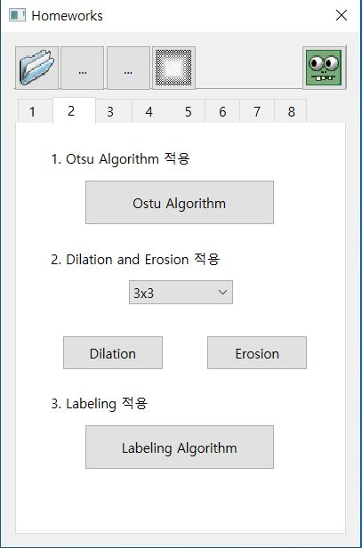
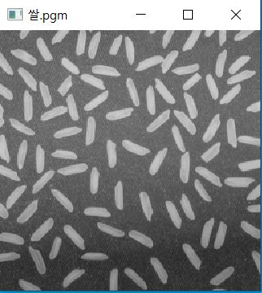
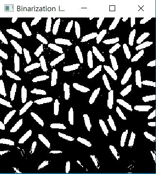
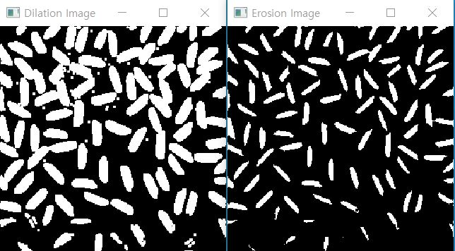
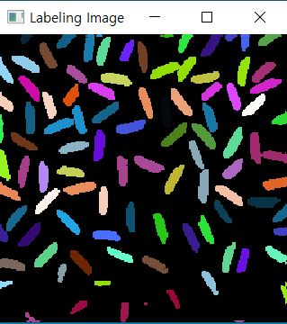

# CV02

1. 메뉴바에 있는 '2'을 클릭하면 다음과 같은 화면이 출력된다.  

  

2. '쌀.pgm' 사진을 불러온다.  

  

3. 'Otsu Algorithm' 버튼을 클릭하면 다음과 같은 화면이 출력된다.  

  

4. 커널의 크기를 정해준 뒤, 'Dilation' 버튼과 'Erosion' 버튼을 클릭하면 다음과 같은 화면이 출력된다.  

  

5. 'Labeling Algorithm'을 클릭하면 8-Neighbor labeling된 그림이 출력된다.  

  
