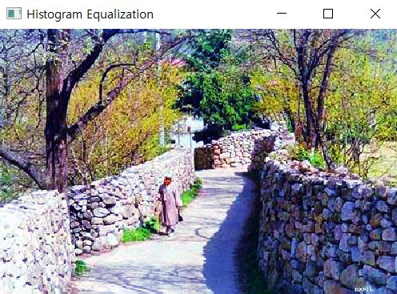

# CV03  

1. 메뉴바에 있는 '3'을 클릭하면 다음과 같은 화면이 출력된다.

  

2. 'sigol-s.bmp' 사진을 불러온다.

  

3. 'Histogram Equalization' 버튼을 클릭하면 다음과 같은 화면이 출력된다.  

  

4. 'Select source image'와 'Select target image'를 이용해 source image와 target image를 정해준다.    

  

5. 'Histogram Matching' 버튼을 클릭하면 다음과 같은 화면이 출력된다.  

  
