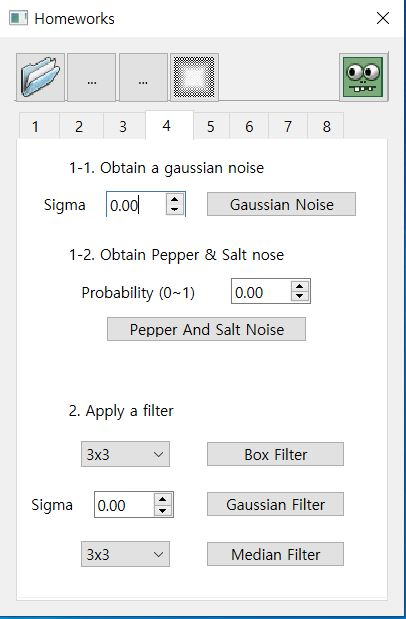
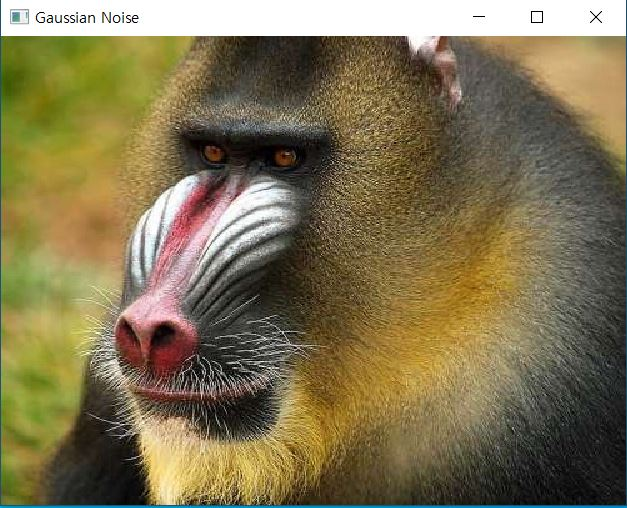
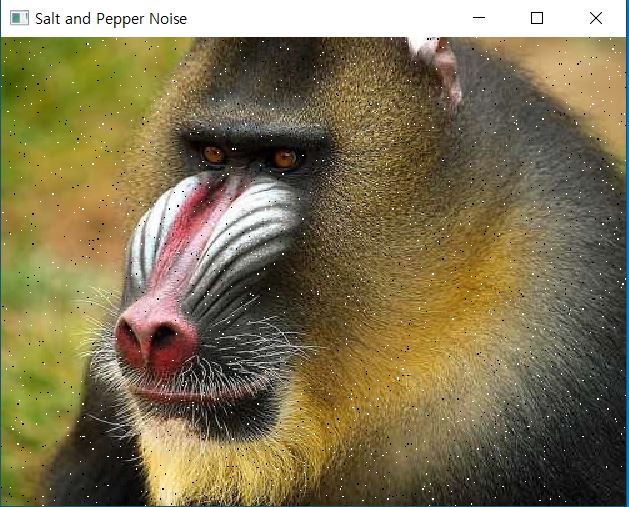
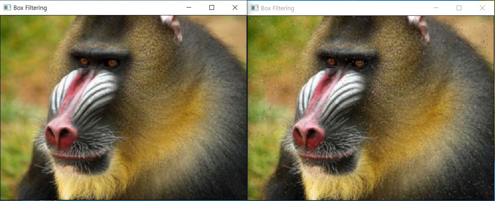
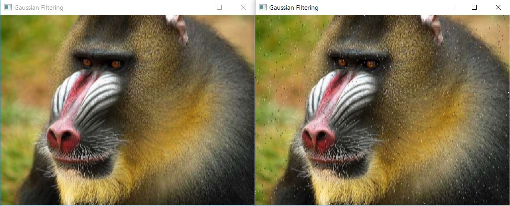
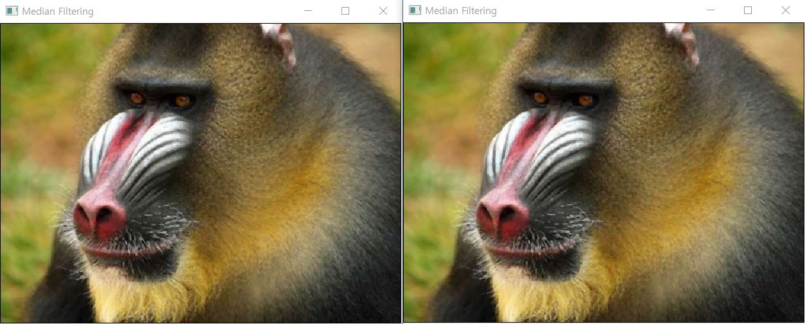

# CV04

1. 메뉴바에 있는 '4'을 클릭하면 다음과 같은 화면이 출력된다.

  

2. 'papio.ppm' 사진을 불러온다.

  

3. Sigma를 1.0으로 설정하고 'Gaussian Noise' 버튼을 누르면 다음과 같은 화면이 출력된다.  

  

4. Sigma를 0.01으로 설정하고 'Pepper And Salt Noise' 버튼을 누르면 다음과 같은 화면이 출력된다.  

  

5. 커널 사이즈를 설정하고 'Box Filter' 버튼을 클릭하면 다음과 같은 화면이 출력된다.  

  

 < Gaussian Noise 사진에 적용 (왼쪽), Pepper and salt Noise 사진에 적용 (오른쪽) >
  

6. Sigma를 1.0으로 설정하고 'Gaussian Filter' 버튼을 클릭하면 다음과 같은 화면이 출력된다.  

  

 < Gaussian Noise 사진에 적용 (왼쪽), Pepper and salt Noise 사진에 적용 (오른쪽) >
  

7. 커널 사이즈를 설정하고 'Median Filter' 버튼을 클릭하면 다음과 같은 화면이 출력된다.  

  

 < Gaussian Noise 사진에 적용 (왼쪽), Pepper and salt Noise 사진에 적용 (오른쪽) >
  
