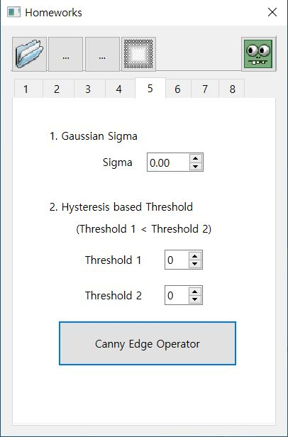
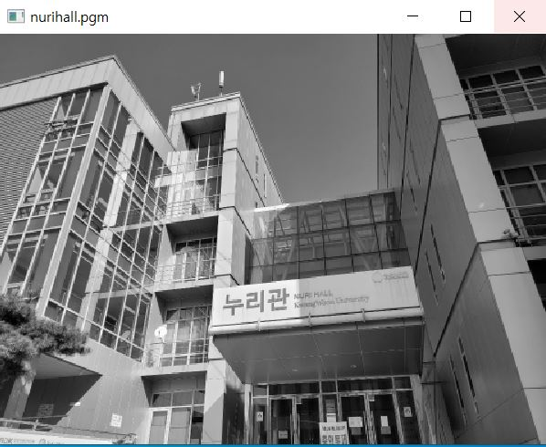
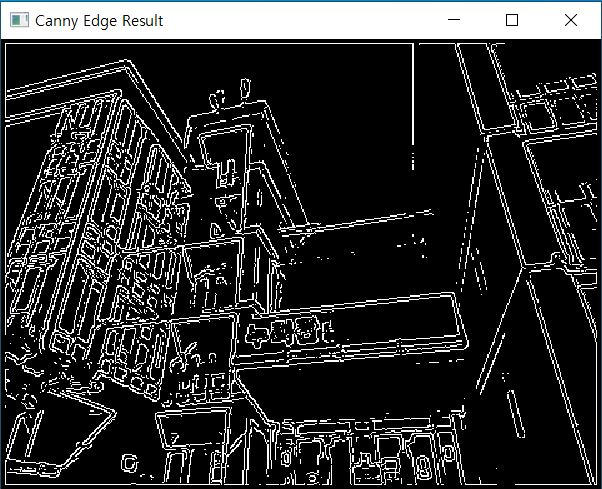

# CV05

1. 메뉴바에 있는 '5'을 클릭하면 다음과 같은 화면이 출력된다.

  

2. 'nurihall.ppm' 사진을 불러온다.

  

3. Sigma를 1.0으로 설정, Threshold 1을 10, Threshold 2를 100으로 설정하고  
  'Canny Edge Operator' 버튼을 클릭하면 다음과 같은 화면이 출력된다.  

  
