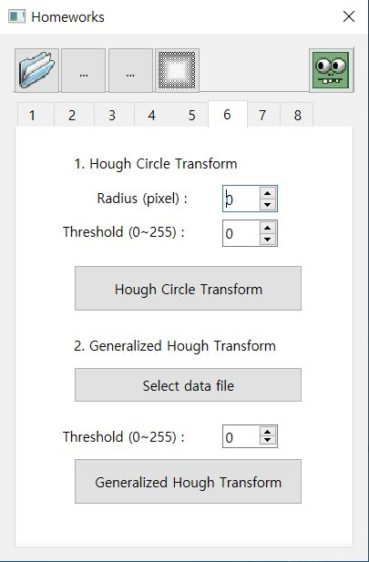
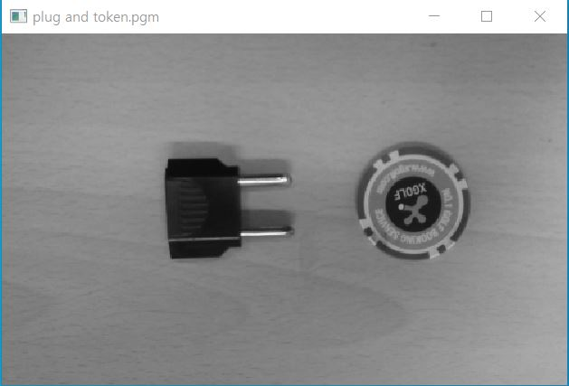
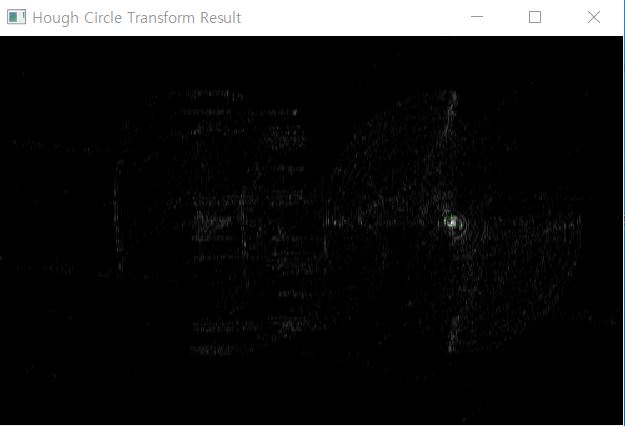
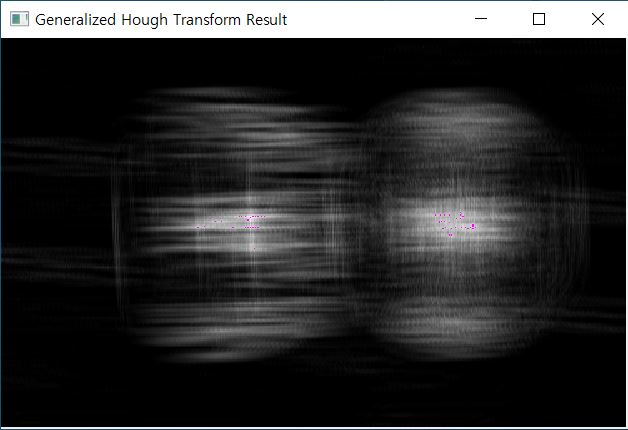

# CV06

1. 메뉴바에 있는 '6'을 클릭하면 다음과 같은 화면이 출력된다.

  

2. 'plug and token.pgm' 사진을 불러온다.

  

3. Radius를 51로 설정, Threshold를 100으로 설정하고    
  'Hough Circle Transform' 버튼을 클릭하면 다음과 같은 화면이 출력된다.  

  

4. 'Select data file' 버튼을 클릭하고 'plug.txt'로 Templete를 정해준 후, Threshold를 200으로 설정한 뒤     
  'Generalized Hough Transform' 버튼을 클릭하면 다음과 같은 화면이 출력된다.  

  
