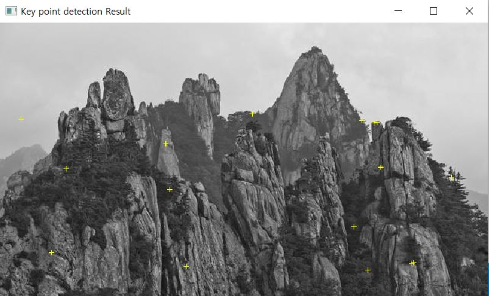

# CV07

1. 메뉴바에 있는 '7'을 클릭하면 다음과 같은 화면이 출력된다.

  

2. 'mountain.pgm' 사진을 불러온다.

  

3. 'Get Gaussian scale Image' 버튼을 클릭하면 다음과 같은 화면이 출력된다.  

  

4. 'Get DOG scale Image' 버튼을 클릭하면 다음과 같은 화면이 출력된다.  

  

5. 'Key point detection' 버튼을 클릭하면 다음과 같은 화면이 출력된다.  

  

6. 'SIFT descriptor' 버튼을 클릭하면 다음과 같은 화면이 출력된다.  

  

7. SIFT feature matching을 위해 '1st Image' 버튼과 '2nd Image' 버튼을 클릭하여 이미지를 선택한 후,   
   'SIFT feature matching' 버튼을 클릭하면 다음과 같은 화면이 출력된다.  
   
   ☑️ **To do list**  
   - [ ] 1st Image와 2nd Image에 'Mountain.pgm' 말고 다른 이미지가 들어갈 시, 튕기는 문제 해결  

  
