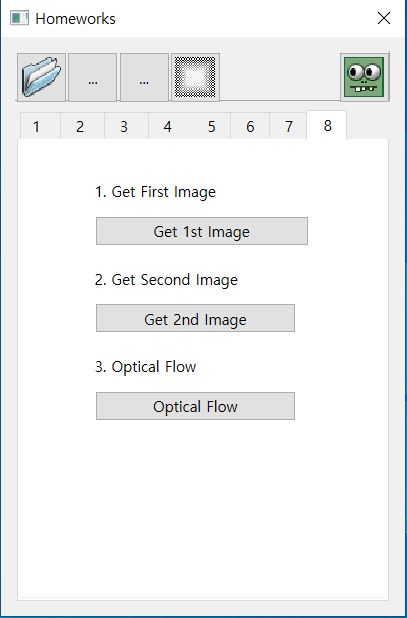
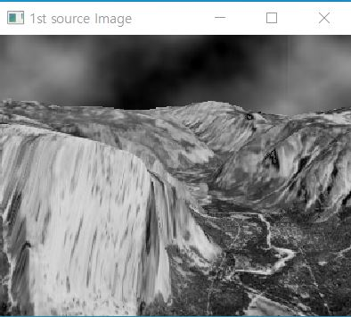
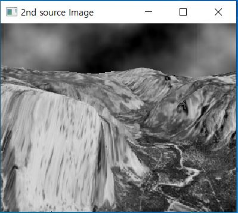
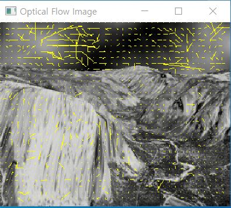

# CV08

1. 메뉴바에 있는 '8'을 클릭하면 다음과 같은 화면이 출력된다.

  

2. 'Get 1st Image' 버튼을 클릭하고 hw08에 있는 폴더 중 하나의 사진을 불러온다.

  

3. 'Get 2nd Image' 버튼을 클릭하고 hw08에 있는 폴더 중 다른 하나의 사진을 불러온다.

  

4. 'Optical Flow' 버튼을 클릭하면 다음과 같은 화면이 출력된다.  

  
