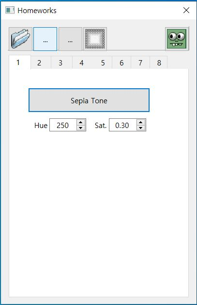

# 2021-Spring-Computer-Vision

Assignment for 2021 spring Computer Vision lecture  

## 개발 환경  
|OS|사용 언어|사용 IDE|Qt version|
|:---:|:---:|:---:|:---:|
|Window 10|C++|Qt Creator|Qt 6.02 MinGW 64-bit|  

## Folders and files description  

- `Homeworks_CV/` : **소스코드가 담겨 있는 메인 폴더**  
  - `data/` : 예제 이미지가 담겨 있는 폴더  
  - `eigen-3.3.8/` : HW08에서 행렬 관련 연산을 하기 위해 가져온 폴더  
  - `kfc.h`, `kfc.cpp` : 교수님께서 제공해주신 라이브러리  
  - `imageform.h`, `imageform.cpp` : QT UI관련한 소스코드  
  - `taeyoungcv.h`, `taeyoungcv.cpp` : 과제 수행을 위한 소스코드 **(대부분의 알고리즘 구현)**  

- `Description` : **어떤 과제를 수행을 했고, 어떻게 동작하는지 설명을 위한 `.md`파일 모음 폴더**  
  - `CV01` ~ `CV08` : 각 과제 문제 설명 및 해결 방법  

## How to use this program 

  

 < 프로그램 실행시 보이는 화면 >
  

메뉴바에 있는 번호를 클릭하면, 해당 Homework을 어떻게 수행했는지 알 수 있다.  
1. `HW01` : Hue, Value, Saturation, 세피아 톤 이미지 출력 - [HW01 solution](https://github.com/Taeyoung96/2021-Spring-Computer-Vision/blob/master/Description/cv01.md)  
2. `HW02` : Otsu algorithm을 이용하여 이진화, Dilation, Erosion, 8-Neighbor labeling 구현 - [HW02 solution](https://github.com/Taeyoung96/2021-Spring-Computer-Vision/blob/master/Description/cv02.md)  
3. `HW03` : Histogram Equalization, Histogram Matching 구현 - [HW03 solution](https://github.com/Taeyoung96/2021-Spring-Computer-Vision/blob/master/Description/cv03.md)  
4. `HW04` : Gaussian-noised Image 만들기, Pepper & Salt Image 만들기, Box filter, Gaussian-filter, Median filter 구현- [HW04 solution](https://github.com/Taeyoung96/2021-Spring-Computer-Vision/blob/master/Description/cv04.md)  
5. `HW05` : FDG algorithm, Canny edge algorithm 구현 - [HW05 solution](https://github.com/Taeyoung96/2021-Spring-Computer-Vision/blob/master/Description/cv05.md)  
6. `HW06` : Hough circle Transform 구현, Generanlized Hough Transform 구현 - [HW06 solution](https://github.com/Taeyoung96/2021-Spring-Computer-Vision/blob/master/Description/cv06.md)  
7. `HW07` : SIFT 구현 (Gaussian scale Image, DOG scale Image, Keypoint Detection, Descriptor) - [HW07 solution](https://github.com/Taeyoung96/2021-Spring-Computer-Vision/blob/master/Description/cv07.md)  
8. `HW08` : Optical Flow 구현 (Image pyramid 구현) - [HW08 solution](https://github.com/Taeyoung96/2021-Spring-Computer-Vision/blob/master/Description/cv08.md)  

